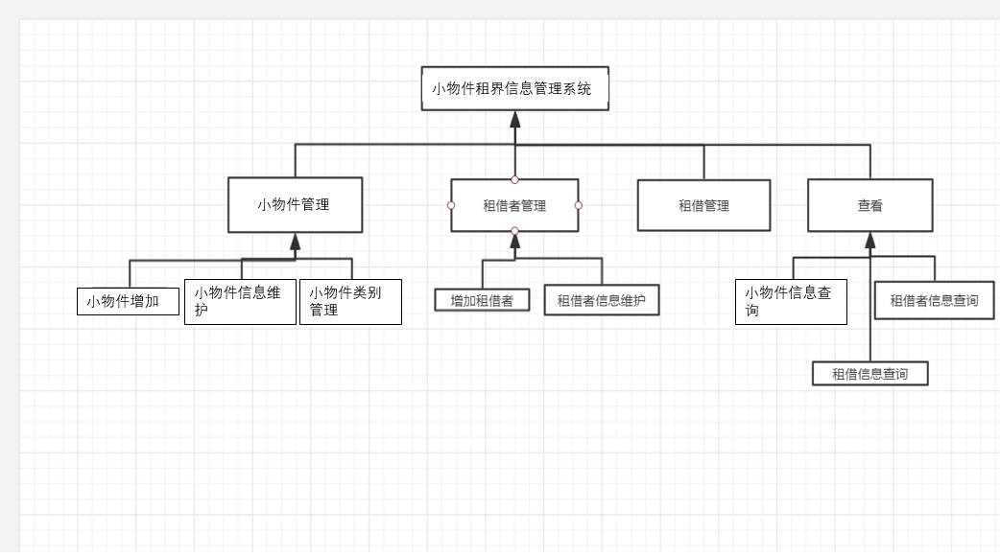
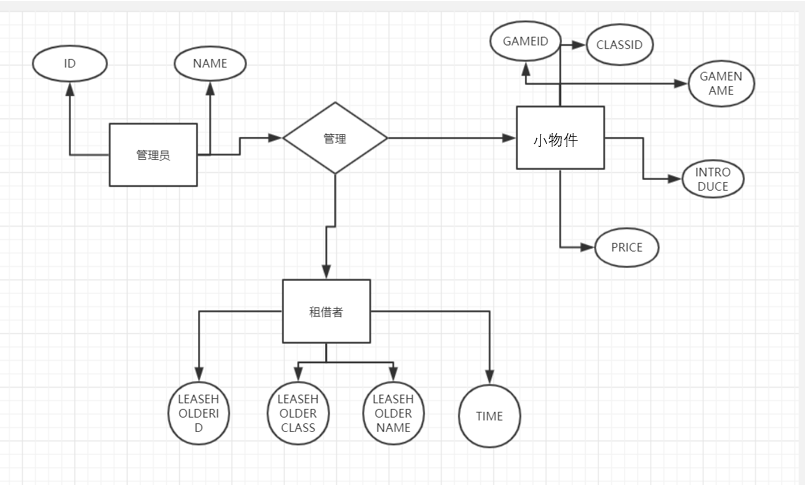
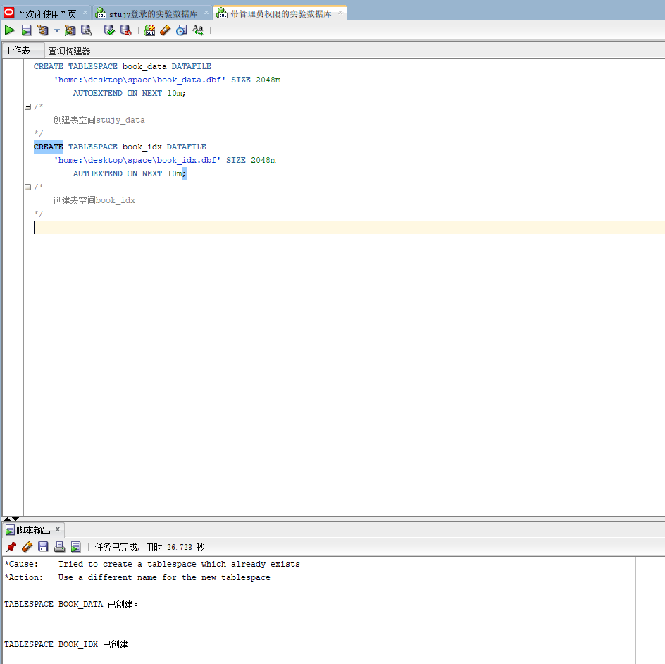
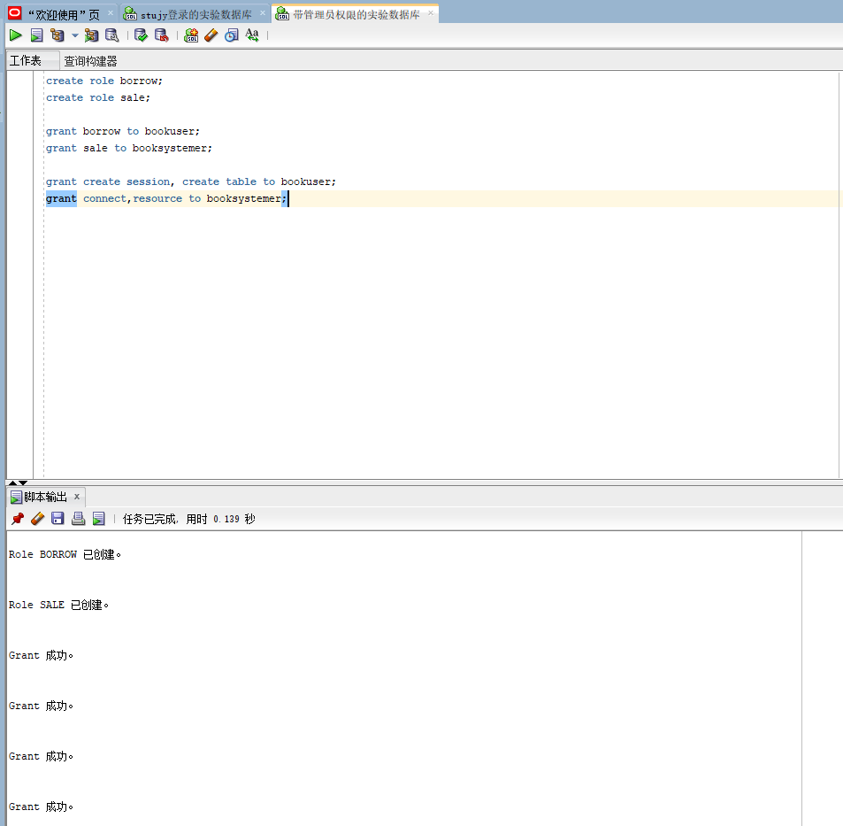
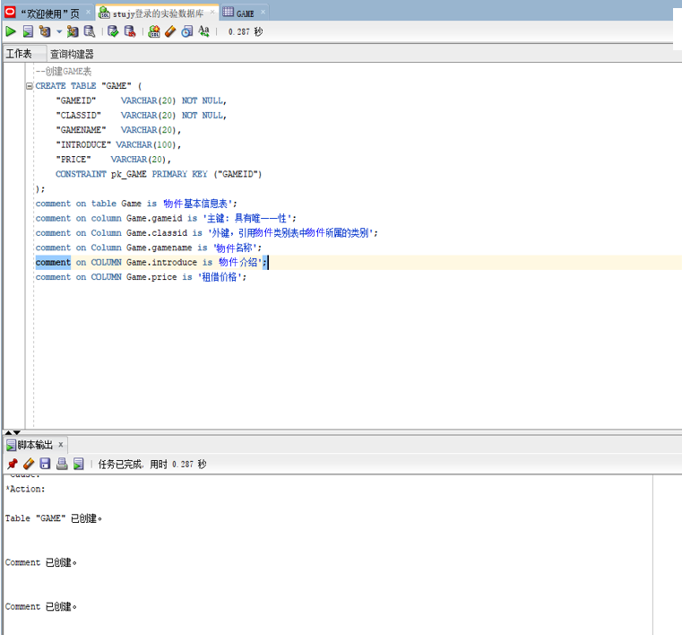
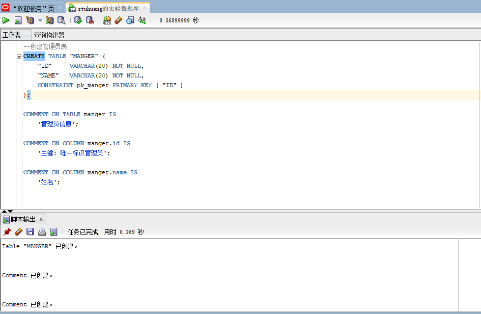
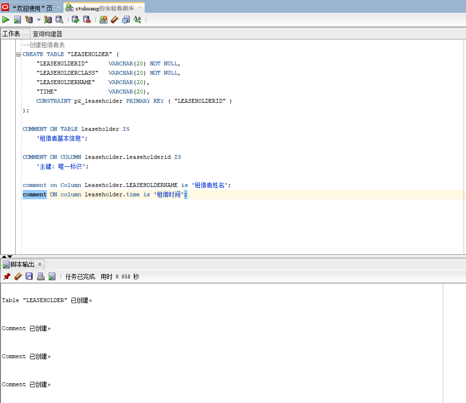
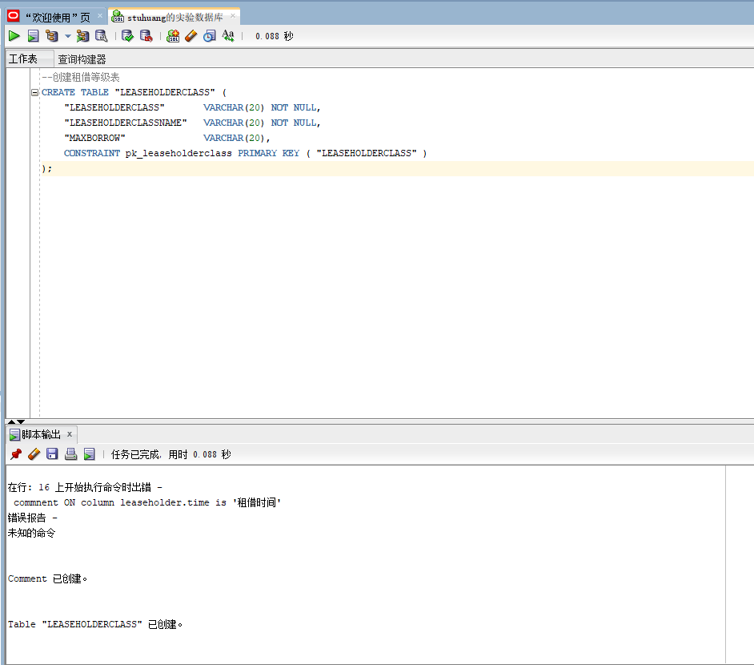
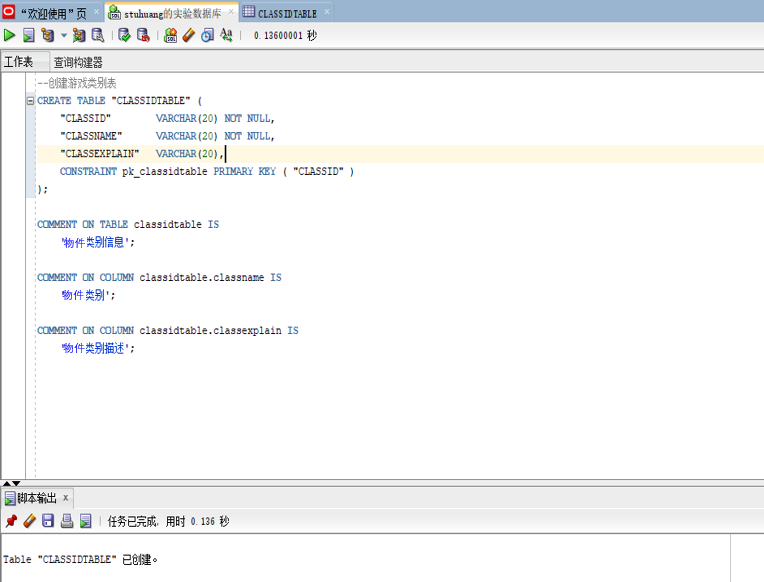
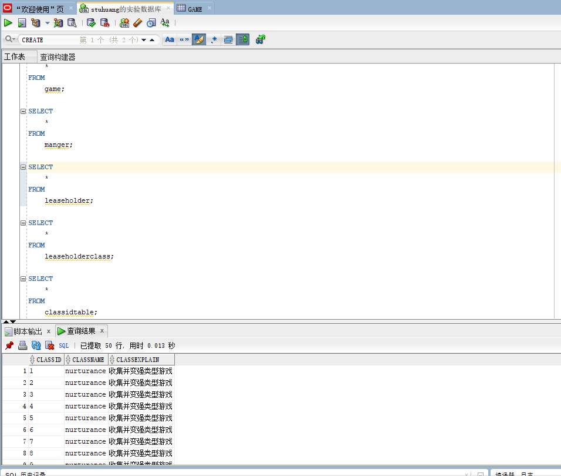

## 实验六
1. **实体之间：**
   
2. **ER：**
  
3. **系统功能：**
  
4. **创建表空间，创建角色，赋予权限**

```
--小物件租借系统
CREATE TABLESPACE game_data DATAFILE
    'home:\desktop\space\game_data.dbf' SIZE 2048m
        AUTOEXTEND ON NEXT 10m;
/*
	创建表空间game_data
*/
create tablespace geme_idx
datafile 'home:\desktop\space\game_idx.dbf'
size 2048m
autoextend on next 10m;
/*
	创建表空间game_idx
*/
create user gameleaseholder identified by 123456;
create user gamemanger identified by 000000;
/*
	创建用户gameleaseholder, gamemanger
*/
create role borrow;
create role sale;
/* 创建两个角色*/
grant borrow to gameleaseholder;
grant sale to gamemanger;

grant create session, create table to gameleaseholder;
grant connect,resource to gamemanger;
/* 赋予权限*/
```
  
  
5. **创建表**

```
--创建GAME表
CREATE TABLE "GAME" (
    "GAMEID"     VARCHAR(20) NOT NULL,
    "CLASSID"    VARCHAR(20) NOT NULL,
    "GAMENAME"   VARCHAR(20),
    "INTRODUCE"	VARCHAR(100),
    "PRICE"    VARCHAR(20),
    CONSTRAINT pk_GAME PRIMARY KEY ("GAMEID")
);
comment on table Game is '小物件基本信息表';
comment on column Game.gameid is '主键: 具有唯一一性';
comment on Column Game.classid is '外键，引用小物件类别表中小物件所属的类别';
comment on Column Game.gamename is '小物件名称';
comment on COLUMN Game.introduce is '小物件介绍';
comment on COLUMN Game.price is '租借价格';

--创建管理员表
CREATE TABLE "MANGER" (
    "ID"         VARCHAR(20) NOT NULL,
    "NAME"       VARCHAR(20) NOT NULL,
    CONSTRAINT pk_MANGER PRIMARY KEY ( "ID" )
);
comment on table Manger is '管理员信息';
comment on column Manger.ID is '主键: 唯一标识管理员';
comment on Column Manger.name is '姓名';

--创建租借者表
CREATE TABLE "LEASEHOLDER" (
    "LEASEHOLDERID"     VARCHAR(20) NOT NULL,
    "LEASEHOLDERCLASS"  VARCHAR(20) NOT NULL,
    "LEASEHOLDERNAME"   VARCHAR(20),
    "TIME"     VARCHAR(20),
    CONSTRAINT pk_LEASEHOLDER PRIMARY KEY ("LEASEHOLDERID")
);
comment on table Leaseholder is '租借者基本信息';
comment on column Leaseholder.LEASEHOLDERID is '主键: 唯一标识';
commnent on Column Leaseholder.LEASEHOLDERNAME is '租借者姓名';
commnent on Column Leaseholder.TIME is '租借时间';

--创建租借等级表
CREATE TABLE "LEASEHOLDERCLASS" (
    "LEASEHOLDERCLASS"     VARCHAR(20) NOT NULL,
    "LEASEHOLDERCLASSNAME"  VARCHAR(20) NOT NULL,
    "MAXBORROW"   VARCHAR(20),
    CONSTRAINT pk_LEASEHOLDERCLASS PRIMARY KEY ("LEASEHOLDERCLASS")
);

--创建小物件类别表
CREATE TABLE "CLASSIDTABLE" (
    "CLASSID"        VARCHAR(20) NOT NULL,
    "CLASSNAME"      VARCHAR(20) NOT NULL,
    "CLASSEXPLAIN"   VARCHAR(20),
    CONSTRAINT pk_CLASSIDTABLE PRIMARY KEY ("CLASSID")
);
comment on table Classidtabe is '小物件类别信息';
comment on column Classidtabe.CLASSNAME is '小物件类别';
comment on column Classidtabe.CLASSEXPLAIN is '小物件类别描述';
```
  
  
  
  
  
6. **插入数据**

```
CREATE OR REPLACE PACKAGE write_data IS  --write_data为包名  
    PROCEDURE writedata;  --声明一个过程  

END write_data;  
  
  
--主体  

CREATE OR REPLACE PACKAGE BODY write_data IS --包名必须一致  

    PROCEDURE writedata IS    --实现规范中的过程  
    BEGIN
        FOR i IN 1..10000 LOOP INSERT INTO game VALUES (
            i + 1,
            '1',
            'pocketmonster',
            '一个收集养成类小物件',
            '15'
        );

        END LOOP;

        COMMIT;
        FOR i IN 1..50000 LOOP INSERT INTO manger VALUES (
            i,
            'stujy'
        );

        END LOOP;

        COMMIT;
        FOR i IN 1..50000 LOOP INSERT INTO leaseholder VALUES (
            i,
            '5',
            'wish',
            '30'
        );

        END LOOP;

        COMMIT;
        FOR i IN 1..50000 LOOP INSERT INTO leaseholderclass VALUES (
            i,
            'wish',
            '5'
        );

        END LOOP;

        COMMIT;
        FOR i IN 1..50000 LOOP INSERT INTO classidtable VALUES (
            i,
            'nurturance',
            '收集并变强类型小物件'
        );

        END LOOP;

        COMMIT;
    END writedata;

END write_data;
```
  
7.**查询数据** 
  


